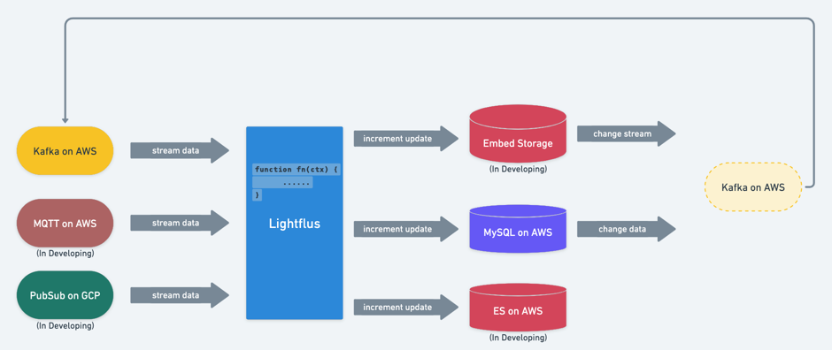

# Overview

## What is Lightflus?

- Lightflus is a *Cloud-Native Dataflow* framework designed for a common purpose;
- You can be free to maintain a complicated dataflow system with Lightflus. Empower your business with a faster and
  resilient data infra;
- Lightflus can be integrated with mainstream cloud vendor (AWS, GCP, Azure) very easy;

## Features of Lightflus

- *Provide Typescript DataStream API,* more lightweight compared with Java and lower learning curve;
- *Easy onboarding*: you can apply your dataflow jobs on Lightflus simply by CLI;
- *Pay-as-you-go:* We provide three instance options on AWS marketplace, you can choose or upgrade to any of them
  as you need.
    - *Small instance*: for small throughput scenery, below 1 thousand elements/s;
    - *Medium instance*: for medium throughput scenery, about 1 thousands elements/s to 5 thousands elements/s;
    - *Large instance*: for large throughput scenery, higher than 5 thousand elements/s;
- *Fault-Tolerance* (In next version): we’re working on this important feature and will release it in next version. We
  use Checkpoint to implement Fault-Tolerance which can promote the scalability and make sure *exactly-once* schema;
- *Implemented by Rust*: Rust is a new programming language which keep good balance between memory security and
  performance. Thanks to Rust, we build Lightflus as a robust and high performance system.
- *Powered by Deno*: Deno is a Javascript runtime co-created by *Ryan Dahl* (He also create Node.JS). We use Deno as an
  embedded runtime for UDF Operator.
- *Source(Sink) Connector*: We will support more Source (Sink) Connectors. For now, only Kafka and ElasticSearch
  Connector is provided.
- *SQL Support* (will release in next version): We will release SQL supporting in next version but, not in the
  traditional
  way.

## Architecture

* Lightflus will fetch data from DataSource like Kafka;
* Lightflus process fetched data and sink to downstream storages;
    * If downstream storage generate change stream, Lightflus can also capture it;

## Difference between Lightflus and Flink

1. ***Cloud-Native***: Lightflus is born for cloud. It's much more agile than Flink. Your team can manage streaming data and
   integrate with existing infrastructure more efficient;
2. ***Lower Cost***: Flink API is written by Java and its runtime is sophisticated. You need to recruit a professional team
   to handle this. The price is very high (time-consuming, cost-expensive and management-risky). Lightflus can offer
   both big companies and small teams a resilient streaming data framework to help them only focus on the core business.
   **Anyone in your current tech team can be a dataflow engineer**.
3. ***Customer Support***: Flink is an open source framework. This means Community is the only place you can ask for help.
   As a commercial company, we provide customer support for each enterprise user. You can solve your problems much
   quicker.